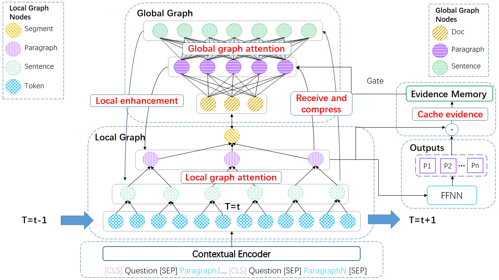

# CGSN

This repository contains code and data for the paper: [Capturing Global Structural Information in Long Document Question Answering with Compressive Graph Selector Network (EMNLP 2022)](https://arxiv.org/abs/2210.05499).

- We propose **C**ompressive **G**raph **S**elector **N**etwork (CGSN), an evidence selection model for long document question answering, which can capture the long-range (global) structural information in a long document.

- Experiments on Qasper and HotpotQA-Doc (the long-document version of HotpotQA) demonstrate the effectiveness of our model.

## Introduction
The proposed model (CGSN) takes a long document and a question as the input to select the question-related evidence paragraphs from the document. 



Afterward, we take the selected evidence paragraphs and the question as the input into [an LED answer generator](https://github.com/allenai/qasper-led-baseline) to generate the final answer.

## Requirements
It is recommended to build **two** Conda environments for CGSN and Answer Generator separately because there might be some Python package conflicts.
### The Proposed Evidence Selector CGSN
- Python 3.7.13
- benepar 0.2.0
- spacy 3.2.3
- numpy 1.17.3
- torch 1.8.1
- transformers 4.20.0
- nltk 3.6.5
- datasets 2.2.1
- beautifulsoup4 4.11.1
- tqdm 4.62.3

### Answer Generator
Please refer to the environment setting in [qasper-led-baseline](https://github.com/allenai/qasper-led-baseline).

## Data Preparation
Make the following data directories:  
```bash
mkdir -p ./data/Qasper
mkdir -p ./data/HotpotQA-Doc/split
````

### Qasper
First, download the raw dataset of [Qasper](https://allenai.org/data/qasper). In our experiment, we use version 0.2 of Qasper.

```bash
QASPER_HOME=./data/Qasper
cd $QASPER_HOME
wget https://qasper-dataset.s3.us-west-2.amazonaws.com/qasper-train-dev-v0.2.tgz
wget https://qasper-dataset.s3.us-west-2.amazonaws.com/qasper-test-and-evaluator-v0.2.tgz
tar zxvf qasper-train-dev-v0.2.tgz
tar zxvf qasper-test-and-evaluator-v0.2.tgz
```


### HotpotQA-Doc
Our HotpotQA-Doc dataset is based on the [HotpotQA](https://hotpotqa.github.io/) dataset. 

Firstly, run the following code **one by one** to crawl corresponding Wikipedia articles and create the HotpotQA-Doc dataset.

```Python
python collection_all_wiki_titles_from_hotpotqa.py
python convert_html_to_txt.py
python convert_hotpotqa_into_qasper_format.py
python converge_all_train_parts.py
python hotpotqa_title_distinguish.py
```

You can also download the created HotpotQA-Doc dataset [here](https://drive.google.com/drive/folders/17rW7PWuHoUMJhSKWMm-7s-OK_XNy_1eE?usp=sharing) with no need to run the above Python scripts. Unzip the Folder and move all files into `./data/HotpotQA-Doc/split` directory.


## Model Training and Inference
### Qasper
#### CGSN
We use [SciBERT](https://github.com/allenai/scibert) as the main backbone model upon which we build the proposed CGSN. The aim of CGSN is to select evidence paragraphs related to specific questions.


Firstly, convert raw data into cached features:

```bash
./preprocess_qasper_train_scibert.sh
./preprocess_qasper_dev_scibert.sh
./preprocess_qasper_test_scibert.sh
```

Then, run the following scripts to train the proposed CGSN and do inference on each checkpoint:
```bash
./train_qasper_scibert.sh
```

After that, we use the following command to calculate the Evidence-F1 score of each checkpoint:
```bash
cd ./qasper-led-baseline/scripts
python evidence_retrieval_heuristic_baselines.py ../../data/Qasper/qasper-dev-v0.2.json '../../output-scibert-qasper/predictions_[0-9]*.txt' 0.1
cd ../..
```
We find `epoch-2` reaches the best in Evidence-F1.

Therefore, we use the following scripts to calculate the paragraph selection result on the test set with the best checkpoint:
```bash
./eval_qasper_scibert.sh
```

Then, we run the following command to calculate the Evidence-F1 score of the best checkpoint on the test set:
```bash
cd ./qasper-led-baseline/scripts
python evidence_retrieval_heuristic_baselines.py ../../data/Qasper/qasper-test-v0.2.json '../../output-scibert-qasper/epoch-2/predictions_test.txt' 0.1
cd ../..
```

Based on that, we run the following command to extract question-related evidence from the test set:
```bash
python convert_retreived_evidence_to_dataset.py ./data/Qasper/qasper-test-v0.2.json ./output-scibert-qasper/epoch-2/predictions_test.txt scibert 0.1 test
```
After that, the question with the selected evidence file will be output to the path:
```bash
./data/Qasper/qasper-test-v0.2-predicted-evidence-scibert-epoch-2_scibert-0.1.json
```

NOTE: `torch.Tensor.scatter_add_` is a method used in CGSN. According to [Pytorch Documentation](https://pytorch.org/docs/stable/generated/torch.Tensor.scatter_add_.html), "_This operation may behave nondeterministically when given tensors on a CUDA device._". Therefore, CGSN produces _slightly_ different results every time to do training or predicting. However, the conclusion drawn in the paper still holds despite this randomness.

#### Answer Generator
For each dataset (i.e. Qasper or HotpotQA-Doc), we use only **one** trained Answer Generator, which takes selected evidence and question as input to generate the final answer. In this way, we can calculate the Answer-F1 score for the proposed CGSN.

When running the Answer Generator, we recommend using the setting in `./qasper-led-baseline/requirements.txt` to create a **new** Conda environment.

Firstly, train the Answer Generator with a question and its related gold evidence in the training set:
```bash
cd ./qasper-led-baseline
./train_evidence_to_answer_qasper.sh 0
```

After that, take the file `./data/Qasper/qasper-test-v0.2-predicted-evidence-scibert-epoch-2_scibert-0.1.json` as the input when running the script:
```bash
./evidence_to_answer.sh 0 ../data/Qasper/qasper-test-v0.2-predicted-evidence-scibert-epoch-2_scibert-0.1.json output_with_evidence/result-qasper.txt
```
It finally outputs the Answer-F1 scores of the model in the file `output_with_evidence/result-qasper.txt`.


### HotpotQA-Doc
Because our [HotpotQA-Doc dataset](https://drive.google.com/drive/folders/17rW7PWuHoUMJhSKWMm-7s-OK_XNy_1eE?usp=sharing) is in the same format as Qasper. Scripts to implement experiments on HotpotQA-Doc are nearly the same. To re-implement it, the only thing you need to do is to change the file paths in the above steps. Our training and inference setting in HotpotQA-Doc is also the same as that of Qasper.


## Reference
Please cite the paper in the following format if you use our model or dataset during your research.

```bibtex
@inproceedings{nie2022capturing,
    title = {Capturing Global Structural Information in Long Document Question Answering with Compressive Graph Selector Network},
    author = {Nie, Yuxiang and Huang, Heyan and Wei, Wei and Mao, Xian-Ling},
    booktitle = {Proceedings of the 2022 Conference on Empirical Methods in Natural Language Processing},
    month = {December},
    year = {2022},
    address = {Online and Abu Dhabi},
    publisher = {Association for Computational Linguistics},
}
```

## Q&A
If you encounter any problem, feel free to either directly contact the [first author](mailto:jerrrynie@gmail.com) or leave an issue in the Github repo.